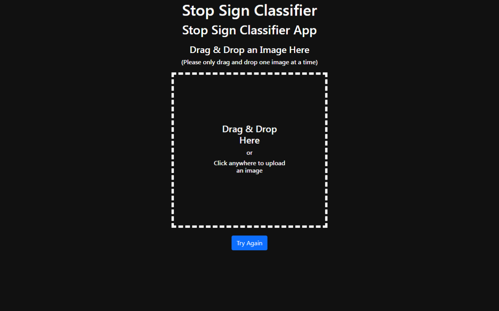

# AI-Powered Traffic Sign Detector



## Project Overview

This project involves creating a custom traffic sign classifier that identifies stop signs using machine learning models trained with PyTorch. The model is deployed as a web application using IBM Code Engine, allowing users to interact with the classifier online.

## Training Performance

The training accuracy of the model reached 70%, showing optimal performance during training. However, testing with some images from the internet indicated that the model requires further training and improvement to enhance its accuracy and robustness.

## Project Structure

- **`notebooks/`**: Jupyter notebooks for data preprocessing, model training, and evaluation.
- **`models/`**: Saved models and checkpoints.
- **`images/`**: Sample images for testing and project banners.
- **`app/`**: Code for deploying the model as a web app.
- **`data/`**: Training and testing datasets.

## Installation

Clone the repository and install the dependencies.

```bash
git clone https://github.com/aal-blessed/AI-Powered-Traffic-Sign-Detector.git
cd AI-Powered-Traffic-Sign-Detector
pip install -r requirements.txt
